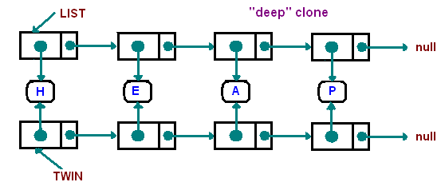

Data Structure
=========

What is it?
-----------
Examples about how you can make a all kind of lists and oders kinds of data structure in Java

Operations
-----------
Implementation of the list data structure may provide some of the following operations:

a constructor for creating an empty list;
an operation for testing whether or not a list is empty;
an operation for prepending an entity to a list
an operation for appending an entity to a list
an operation for determining the first component (or the "head") of a list
an operation for referring to the list consisting of all the components of a list except for its first (this is called the "tail" of the list.)
an operation for accessing the element at a given index.

